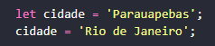
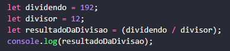
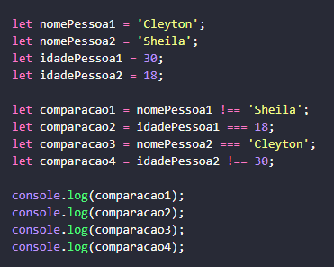
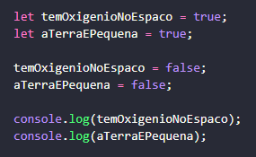
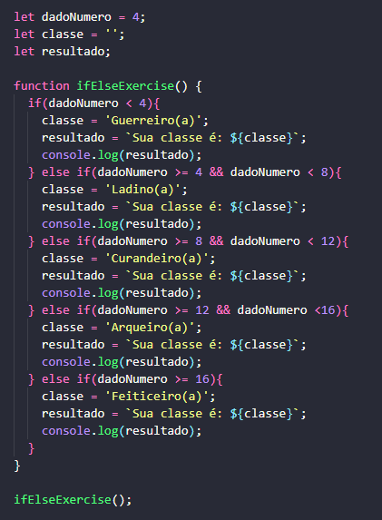
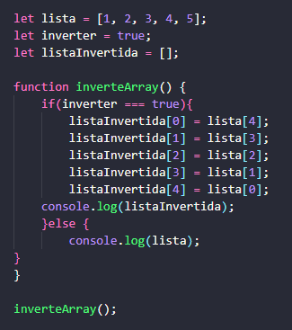
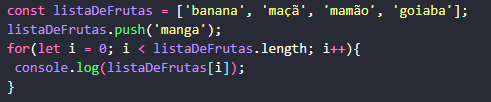
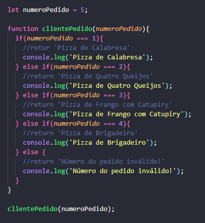

# Atividades JavaScript 

## Conteúdo
### Variáveis, constantes e tipos primitivos :
  

### Operadores aritméticos :
  

### Operadores de comparação :
 

### Operadores lógicos :  
  

### Estrutura condicional if/else :  

### Arrays :  

### Estrutura de repetição for :  

### Funções :
